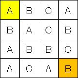
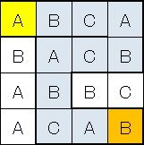

コード銀行：ABC迷路
====

使用例
`./run.sh`
`./maze_info.rb abc_maze/case1.in.txt`

## 解答
[answer_abc_maze.txt](answer_abc_maze.txt) を参照してください。

## 問題文
###【ABC迷路】

次のように、"A", "B", "C"が矩形に並べられています。

この矩形の左上をスタートとし、右下をゴールとします。スタート地点から、"A", "B", "C", "A", "B", "C", "A", "B", …のように移動します。移動できる範囲は、現在地点から上・下・左・右のみです。

上記の例で、左上は"A"となっています。また、この地点は矩形の端になりますので、上と左の方向には移動できません。右と下の方向は、"A"の次にあたる"B"になっていますので、どちらにも移動することがきます。

右側の"B"に移動すると、さらに右側に"C"がありますので、さらに移動することが可能ですが、下側の"B"に移動してしまうと、隣接箇所に"C"が一つも無く、移動することができません。

このようなルールで進めていくと、次のようなルートを辿ればゴールまでたどり着くことができます。

###【問題】

迷路（ABCの矩形データ）がテキストファイルとして与えられます。

それを読み込んで、迷路のスタート地点からゴール地点までたどり着けるかを判定し、たどり着ける場合は"possible"、たどり着けない場合は"impossible"と表示してください。

##【例】

入力

    ABCA
    BACB
    ABBC
    ACAB
出力

    possible

##【解答方法】

まずはabc_maze.zipをダウンロードしてください。

中には10個のファイルが含まれています。
[01]answer_abc_maze.txt

解答用テキストファイルです。

必要事項を記入し、テキストファイルのままアップロードしてください。
[02]sample.in.txt

[03]sample.out.txt

例で示したデータと、その解答です。
[04]case1.in.txt

[05]case2.in.txt

[06]case3.in.txt

[07]case4.in.txt

[08]case5.in.txt

[09]case6.in.txt

[10]case7.in.txt
これらを入力として、プログラムの実行結果を解答してください。
【注意】

・問題本文だけでなく「解答評価のポイント」「その他注意事項」を必ずお読みください。

## 【出題URL】
[https://codeiq.jp/q/974](https://codeiq.jp/q/974)

## Author
[MotokiMiyahara](https://github.com/MotokiMiyahara/)

